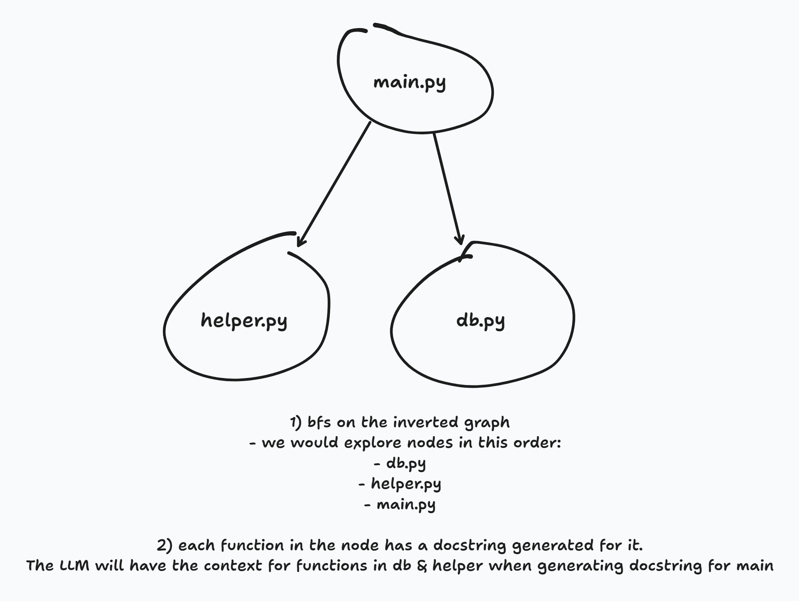

# auto-docs

## Running the program

Update `.env.template` to contain your OPENAI_API_KEY and rename it to `.env`.

Update `PACKAGE_NAME` inside `Makefile` to be your package that you want to generate docstrings for.
Ensure that the `PACKAGE_NAME` corresponds to a python package in the same folder as this README.

Run `make entire` to generate the docstrings in your python code.

See example system design below:

## Roadmap

    - [X] Python functions
    - [X] Aliased python functions
    - [ ] Python classes
    - [ ] Module level docstring
    - [ ] Package level docstring
    - [ ] CLI tool, i.e. run on package regardless of where in the folder structure the code is.
    - [ ] Custom pydeps parser using ast

